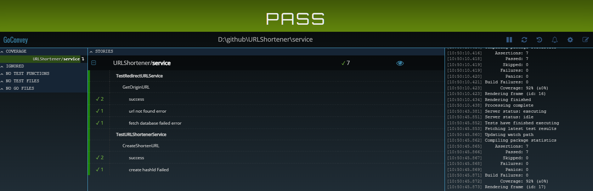

# URLShortener

--------
## 安裝 
* Docker
* Docker Compose
## 啟動
* docker-compose build --no-cache
* docker-compose up

--------
## 系統設計
* [系統設計](doc/system_design.md)

--------
## 目錄說明
<pre>
URLShortener
├─common
│  ├─define ----------- 常數
│  └─errorx ----------- 錯誤碼
├─controller ------- 溝通層 (gin)
│  └─restctl ---------- RESTful API
│      └─transform ---- DTO, BO互相轉換的邏輯
├─doc -------------- 文件相關
├─log -------------- log tool (logrus)
├─model
│  ├─bo --------------- 邏輯層IO model
│  ├─dto -------------- 傳輸層IO model
│  └─po --------------- 資料層IO model & ORM model  
├─repo ------------- 資料層
│  ├─mock ------------- 資料層模擬 (mockgen)
│  └─redisHelper ------ infra tool (go-redis) 
└─service ---------- 邏輯層
</pre>
--------
## 組件
### Redis
* in-memory data store, 低延遲(低於一毫秒), 高傳輸量, cluster mode 支援高可用 & 可擴展性
* 支援持久化, 但有高可用的情境下或許可以不用考慮持久化

--------
## 套件
### google/wire
* 依賴注入解決方案之一, 依賴關係編寫在靜態檔案中, 方便閱讀, 能在編譯時期檢查依賴錯誤

### gin
* web framework, Response速度快, 性能表現好, 支援 middleware, data binding 等機制

### go-redis
* golang redis client

### logrus
* 支援6種等級的日誌級別: debug、info、warm、error、fatal和panic, 能客製化輸出格式, 顏色

### go convey
* testing 解決方案之一, 能快速建立簡潔的單元測試, 清楚的測試結果報告(web UI)


-------
## API Example
### Upload URL API
#### Request
```console
curl -X POST -H "Content-Type:application/json" http://localhost/api/v1/urls -d '{
    "url": "<original_url>",
    "expireAt": "2021-02-08T09:20:41Z"
}'
```
* 參數限制
  * url format
  * expireAt format(RFC3339) & 不可以帶入過去時間

#### Response
```json
{
    "id": "<url_id>",
    "shortUrl": "http://localhost/<url_id>"
}
```

### Redirect URL API
#### Request
```console
curl -L -X GET http://localhost/<url_id> => REDIRECT to original URL
```
* 參數限制
    * url_id 長度必須為六碼