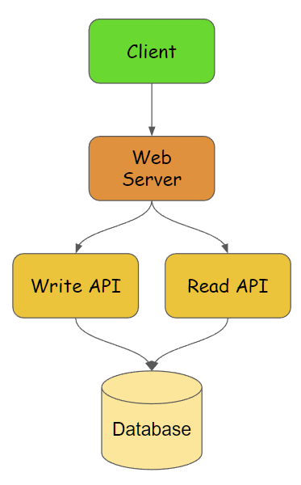
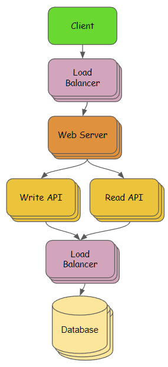

# URLShortener

--------
## 設計方向

### 需求 & 情境假設
* Write API 建立原始網址與短網址的對應
* Read API 以短網址查詢並回傳原始網址
* 讀寫比約 10:1
* 讀取(redirect) response 的速度要快
* 先不估算QPS / usage, 但保留水平擴展空間 & 高可用性

### 高階設計

* web server 轉導 Write API & Read API
* Write API, 負責處理寫入相關的功能, 例如: 建立短網址
* Read API, 負責讀取相關的功能, 例如: 短網址跳轉
* Database, 儲存建立的短網址對應
* 內部溝通建議使用 gRPC, 例如: web server -> write API

### 擴展設計

* 加入load balancer以分散流量至web server集群
* Write API, Read API, 可依需求做不同數量的擴展
* 透過load balancer對Database集群進行操作
* 可擴展database來增加儲存上限與效能 

### 備註
* 本專案目標為符合擴展設計的 write API & read API, 
* 若依設計應拆分兩個服務, 為方便展示先將兩個API合併至同專案中, 但仍由拆分的controller處理 

--------
## 目錄說明

--------
## 資料庫
### Redis
* in-memory data store, 低延遲(低於一毫秒), 高傳輸量, cluster mode 支援高可用 & 可擴展性
* 支援持久化, 但有高可用的情境下或許可以不用考慮持久化

--------
## 套件
### google/wire
* 依賴注入解決方案之一, 依賴關係編寫在靜態檔案中, 方便閱讀, 能在編譯時期檢查依賴錯誤

### gin
* web framework, Response速度快, 性能表現好, 支援 middleware, data binding 等機制

### go-redis
* golang redis client

### logrus
* 支援6種等級的日誌級別: debug、info、warm、error、fatal和panic, 能客製化輸出格式, 顏色

### go convey
* testing 解決方案之一, 能快速建立簡潔的單元測試, 清楚的測試結果報告(web UI)
* 搭配 golang 自帶的 go mock 使用

-------
## API Example
### Upload URL API
```
curl -X POST -H "Content-Type:application/json" http://localhost/api/v1/urls -d '{
    "url": "<original_url>",
    "expireAt": "2021-02-08T09:20:41Z"
}'
```
#### Response
```
{
    "id": "<url_id>",
    "shortUrl": "http://localhost/<url_id>"
}
```

### Redirect URL API
```
curl -L -X GET http://localhost/<url_id> => REDIRECT to original URL
```