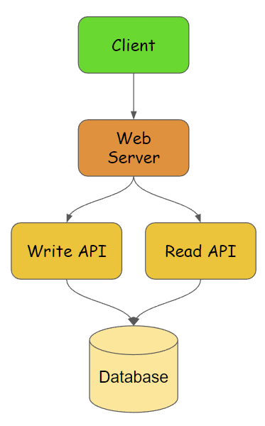
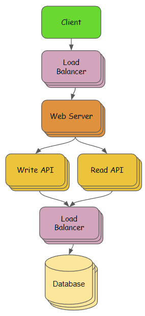

## 系統設計

### 需求 & 情境假設
* Write API 建立原始網址與短網址的對應
* Read API 以短網址查詢並回傳原始網址
* 讀寫比約 10:1
* 讀取(redirect) response 的速度要快
* 先不估算QPS / usage, 但保留水平擴展空間 & 高可用性

### 高階設計

* web server 轉導 Write API & Read API
* Write API, 負責處理寫入相關的功能, 例如: 建立短網址
* Read API, 負責讀取相關的功能, 例如: 短網址跳轉
* Database, 儲存建立的短網址對應
* 內部溝通建議使用 gRPC, 例如: web server -> write API

### 擴展設計

* 加入load balancer以分散流量至web server集群
* Write API, Read API, 可依需求做不同數量的擴展
* 透過load balancer對Database集群進行操作
* 可擴展database來增加儲存上限與效能

### 備註
* 本專案目標為符合擴展設計的 write API & read API,
* 若依設計應拆分兩個服務, 為方便展示先將兩個API合併至同專案中, 但仍由拆分的controller處理 
